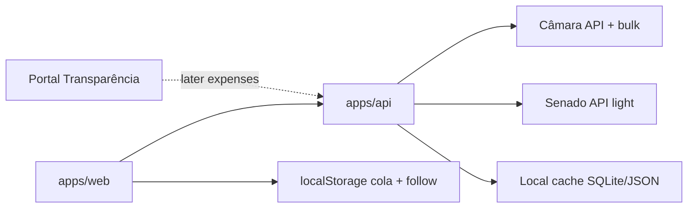

# Appolitica PoC Roadmap (4–6 weeks)

## Product framing

The marketing site ([appolitica.floot.app](https://appolitica.floot.app/)) sells **cola + follow + updates + history**. The repo today validates a thinner loop: browse mock politicians → “Votei neste” → localStorage → mailto.

**Chosen bet for this phase:** keep both tracks thin.
- **Track A — Cola:** better per-cargo slate UX, still local/mock (TSE later).
- **Track B — Follow federal:** real deputies (and light senators) via BFF.

**North star for the PoC:** *“I can build a simple cola AND follow my federal deputy with real recent votes/bills in plain Portuguese.”*

No user accounts in this window — localStorage stays the personal store. Auth stays a later phase (site “Cadastre-se” can remain marketing-only).

---

## Data sources (roles)

| Source | Role in this PoC | Notes |
|--------|------------------|--------|
| [Câmara Dados Abertos](https://dadosabertos.camara.leg.br/swagger/api.html) | **Primary real source** | No key; lists, profiles, proposições, votações; daily bulk JSON for seed |
| [Senado Dados Abertos](https://legis.senado.leg.br/dadosabertos/api-docs/swagger-ui/index.html) | Secondary (week 5–6) | No key; list/profile; prefer `/processo` + `/votacao` (not deprecated `/materia`) |
| [Portal da Transparência](https://api.portaldatransparencia.gov.br/swagger-ui/index.html) | **Post-PoC / optional enrich** | Requires `chave-api-dados` ([register](https://portaldatransparencia.gov.br/api-de-dados/cadastrar-email)); strong on executive spending, weak for “what my deputy voted”; Câmara already has CEAP via `/deputados/{id}/despesas` |

**Do not call any of these from the browser** (CORS + rate limits). All external calls go through `apps/api`.

IDs are not shared across houses → normalize as `{ casa: 'CD' \| 'SF', externalId }`.

---

## Domain model (do this first)

Evolve [`apps/web/src/types/politico.ts`](apps/web/src/types/politico.ts) (and mirror in a thin shared package or API types) so cola and follow do not collide:

- **`Mandatario`** — elected officeholder (Câmara/Senado-backed): `casa`, `externalId`, `nome`, `partido`, `uf`, `fotoUrl`, `cargo`
- **`CandidatoCola`** — election slate slot (mock for now): `cargo`, `nome`, `partido`, `uf`, optional `politicoId` if linked
- **`MeuAcompanhamento`** — follow list (replaces/extends `MeuRepresentante`)
- **`MinhaCola`** — map of `cargo → escolha` (one pick per cargo for the election)
- **`Acao`** — normalized feed item: `tipo` (`votacao` \| `projeto` \| `evento`), `titulo`, `descricaoSimples`, `data`, `fonteUrl`

Keep governors/state deputies/president as **mock-only** until TSE/other sources; federal deputies (and later senators) come from the BFF.

---

## Architecture to add

### `apps/api` (new BFF)
- Stack: Node + TypeScript (Hono or Fastify) to match the pnpm/turbo monorepo
- Endpoints (minimal):
  - `GET /health`
  - `GET /politicos?casa=&uf=&partido=&q=` — merged catalog (seeded + cached)
  - `GET /politicos/:casa/:id` — profile
  - `GET /politicos/:casa/:id/acoes?desde=` — recent votes/bills (plain-language titles)
  - `POST /sync/camara` — admin/cron-style seed refresh (manual trigger OK for PoC)
- Caching: SQLite or on-disk JSON under `apps/api/data/` (good enough for PoC; no Redis)
- Seed strategy: nightly/manual download of Câmara bulk (`deputados`, recent `votacoes` / `votacoesVotos`, `proposicoes`) + light live API for detail
- Env: no Câmara key; reserve `PORTAL_TRANSPARENCIA_TOKEN` unused until later

### `apps/web` changes
- Point [`usePoliticos`](apps/web/src/hooks/usePoliticos.ts) at BFF for federal; keep local mock JSON for non-federal cargos used by cola
- Split UX tabs/concepts:
  - **Cola** — per-cargo picks (new thin UI)
  - **Explorar / Meus** — follow mandatários + activity feed
- Add a simple activity list on detail + “Meus” (real `acoes` from BFF)
- Keep mailto “Cobrar”; optionally include last 1–2 real actions in the draft body

---

## Week-by-week plan

### Weeks 1–2 — Foundation + Câmara seed
- Scaffold `apps/api` in turbo/pnpm
- Implement Câmara client + seed of current legislature deputies
- Normalize `Mandatario` model; cache locally
- Wire web: Explorar can list **real deputies** (UF/partido/nome filters)
- Keep existing mock JSON for other cargos so the app does not shrink

### Weeks 2–3 — Follow + real actions
- `GET .../acoes` from proposições authored + recent votações involving the deputy
- Plain-language copy helpers (template strings, not LLM yet): e.g. “Votou [Sim/Não/Obstrução] em [ementa curta]”
- Detail panel + Meus show real feed; drop the hand-written single mock action for federal IDs
- Follow still in localStorage (`MeuAcompanhamento`)

### Weeks 3–4 — Cola UX (thin, local)
- New Cola view: slots for `presidente | governador | senador | deputado_federal | deputado_estadual`
- Pick from catalog (federal picks can be real deputies; others from mock)
- Persist `MinhaCola` separately from follow list (user can follow without “voting”, and vice versa)
- Align copy with site: “Monte sua cola” vs “Acompanhe”

### Weeks 4–5 — Polish the dual loop
- UF-first onboarding prompt on Início (“Sou de ___”) → prefilter Explorar
- Empty states, loading, error from BFF
- Deep-link-ish tab state optional; not full router required
- “Cobrar” mailto includes last actions when available

### Weeks 5–6 — Senado light + harden
- Seed/list current senators; profiles; basic recent activity via `/votacao` or `/processo`
- Sync job documentation + `pnpm` scripts (`dev` runs web+api)
- Basic smoke tests for API mappers; README update for env/run
- **Explicitly out of scope this window:** auth, notifications push, TSE candidates, Portal da Transparência live calls, media news scraping, PWA, vote-history compare across elections

---

## Portal da Transparência (parked, with a hook)

Useful later for **gasto público / favorecidos**, not for cola or congressional votes. For deputy CEAP, prefer Câmara first.

When ready:
1. Register token via Gov.br
2. Store `PORTAL_TRANSPARENCIA_TOKEN` only on the BFF
3. Add `GET /politicos/CD/:id/despesas` wrapping Câmara CEAP first; only then consider Portal for broader executive context

Do **not** block the 4–6 week PoC on this API.

---

## Success criteria (end of window)

1. Explorar shows hundreds of real deputies (not 22 mock-only federals)
2. Following a deputy shows real recent votes/bills with source links
3. Cola has a clear per-cargo UI persisted locally
4. BFF is the only caller of Câmara/Senado; web never hits them directly
5. Non-federal cargos still work via mock so the full election story remains demoable
6. README documents how to run web+api and refresh Câmara seed

---

## Key files to touch

- New: `apps/api/` (server, Câmara client, cache, routes)
- [`apps/web/src/types/politico.ts`](apps/web/src/types/politico.ts) — split cola vs follow models
- [`apps/web/src/hooks/usePoliticos.ts`](apps/web/src/hooks/usePoliticos.ts) — BFF + mock merge
- [`apps/web/src/hooks/useMeusRepresentantes.ts`](apps/web/src/hooks/useMeusRepresentantes.ts) — follow + new cola hook
- [`apps/web/src/App.tsx`](apps/web/src/App.tsx) — Cola tab / flows
- [`apps/web/public/data/politicos.json`](apps/web/public/data/politicos.json) — shrink to non-federal mock over time
- Root [`package.json`](package.json) / [`pnpm-workspace.yaml`](pnpm-workspace.yaml) / [`turbo.json`](turbo.json) — include api
- [`README.md`](README.md) — update MVP scope vs roadmap

---

## Risks / constraints

- Câmara rate limits / 503 → prefer bulk seed + cache
- Senado API migration (deprecated materia routes) → use new paths only
- Same person across houses has different IDs → no cross-link in this PoC
- Site promises login/notifications/history — treat as roadmap, not PoC scope, to avoid scope creep
